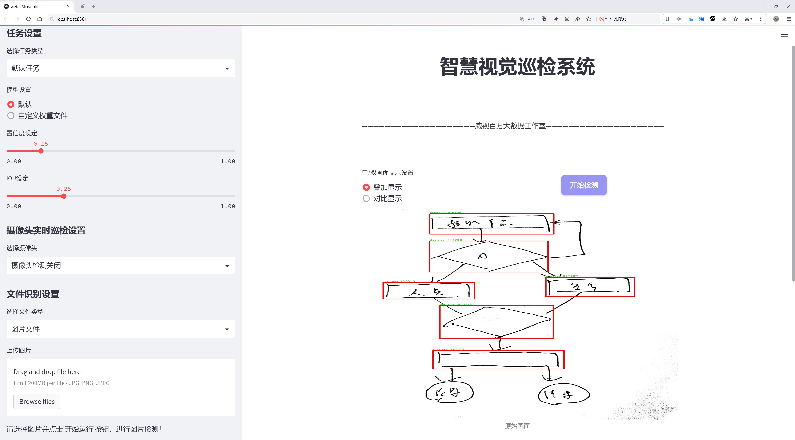
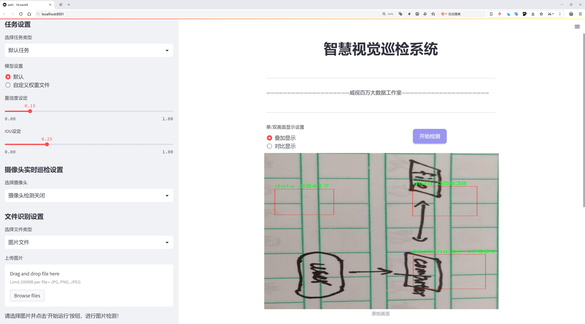
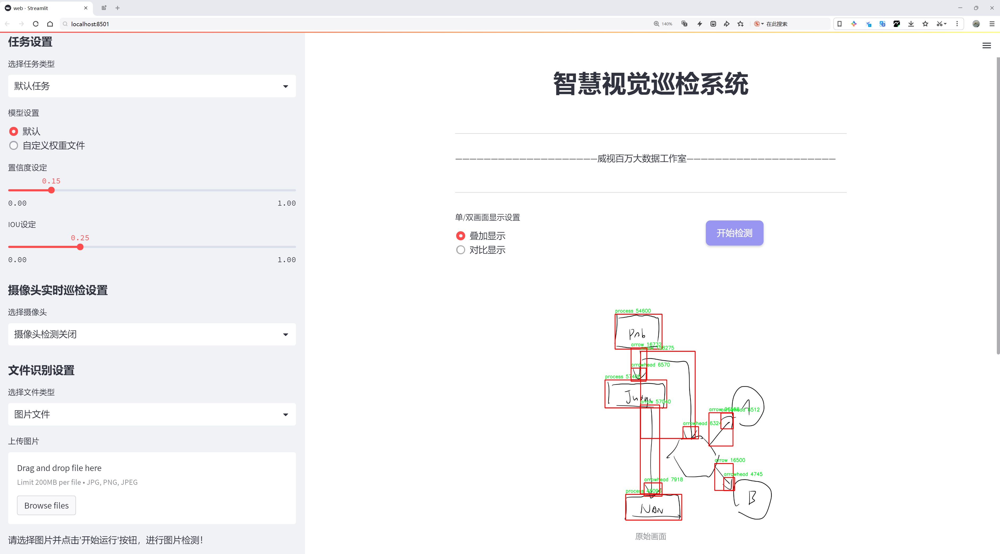
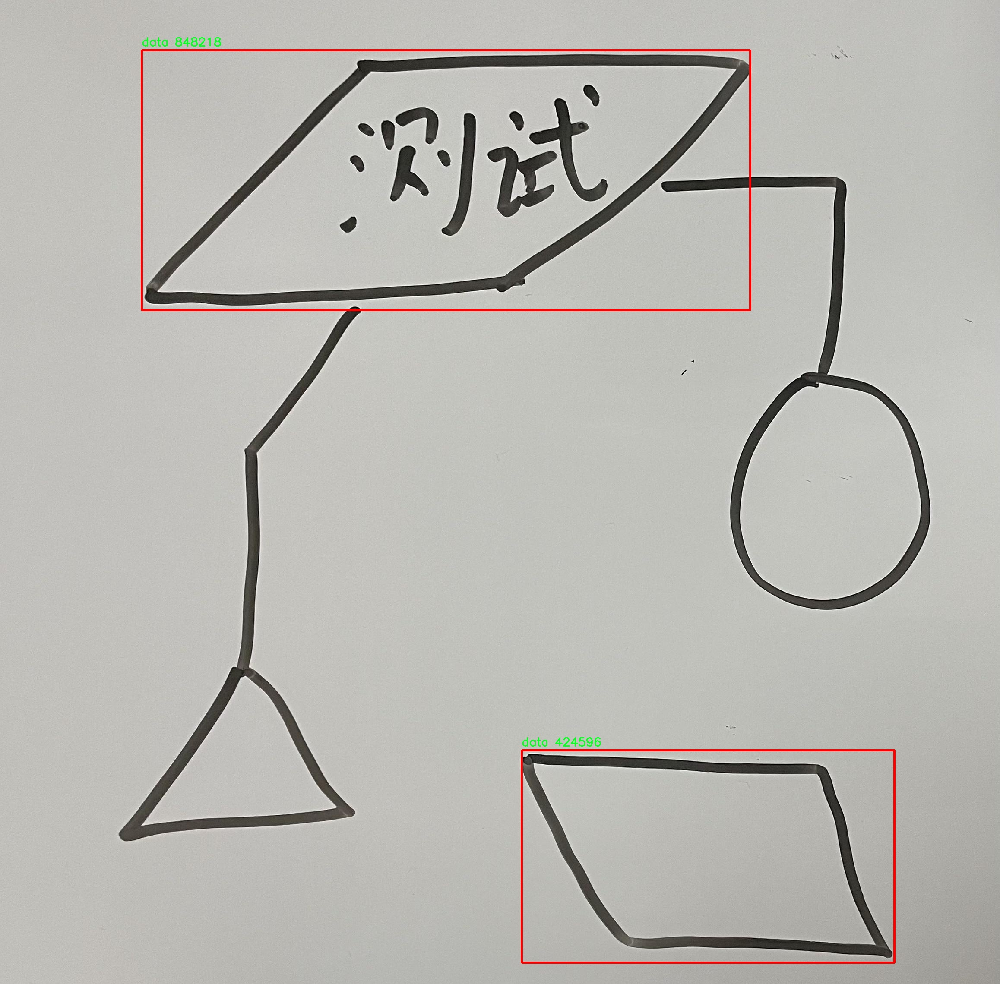
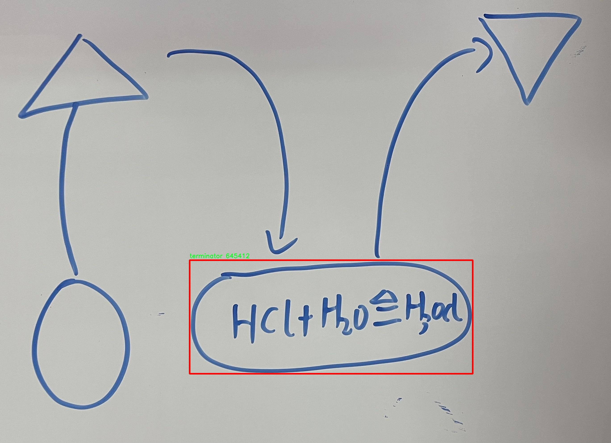
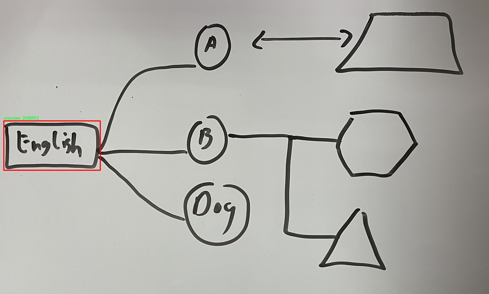
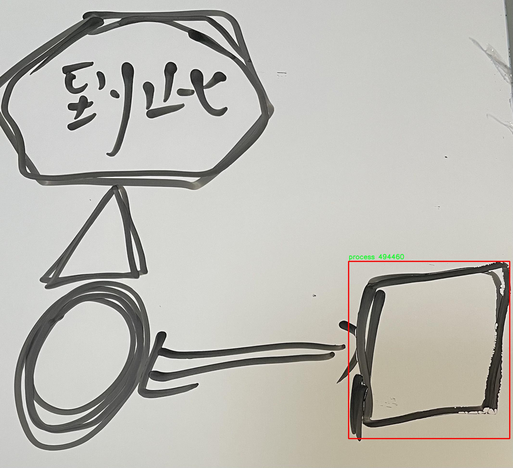
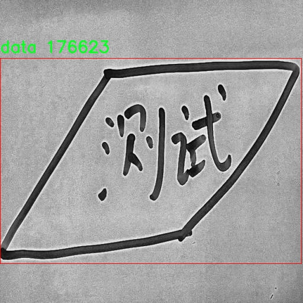

# 手写流程图元素检测检测系统源码分享
 # [一条龙教学YOLOV8标注好的数据集一键训练_70+全套改进创新点发刊_Web前端展示]

### 1.研究背景与意义

项目参考[AAAI Association for the Advancement of Artificial Intelligence](https://gitee.com/qunshansj/projects)

项目来源[AACV Association for the Advancement of Computer Vision](https://gitee.com/qunmasj/projects)

研究背景与意义

随着信息技术的迅猛发展，手写流程图作为一种直观且高效的信息表达方式，广泛应用于教育、工程、管理等多个领域。手写流程图不仅能够帮助人们理清思路、梳理逻辑关系，还能在团队协作中促进信息的共享与交流。然而，传统的手动识别和处理手写流程图的方式往往效率低下，且容易受到人为因素的影响，导致识别结果的不准确。因此，开发一种高效、准确的手写流程图元素检测系统显得尤为重要。

近年来，深度学习技术的快速发展为图像识别领域带来了革命性的变化。尤其是目标检测算法的不断进步，使得对复杂场景中目标的识别变得更加高效和准确。YOLO（You Only Look Once）系列算法作为当前最为流行的目标检测算法之一，其实时性和高精度的特点使其在各种应用场景中得到了广泛的应用。YOLOv8作为该系列的最新版本，进一步提升了模型的性能和适应性，成为手写流程图元素检测的理想选择。

本研究旨在基于改进的YOLOv8算法，构建一个专门针对手写流程图元素的检测系统。通过对数据集“handwritten flowchart part 3”的深入分析，我们发现该数据集包含3300幅图像，涵盖了六类重要的流程图元素：箭头、箭头头、数据、决策、过程和终止符。这些元素在流程图中扮演着关键角色，其准确识别对于整个流程图的理解和解析至关重要。因此，针对这些元素的检测系统不仅可以提高手写流程图的自动化处理能力，还能为后续的图像分析和信息提取提供坚实的基础。

本研究的意义不仅在于技术层面的创新，更在于其广泛的应用前景。通过实现高效的手写流程图元素检测，我们可以推动教育领域的智能化发展，帮助学生和教师更好地进行知识的传递与交流。同时，在工程和管理领域，该系统能够辅助决策者快速理解复杂的流程，提升工作效率。此外，该研究还将为后续的图像处理和人工智能技术的发展提供有益的借鉴，推动相关领域的研究进展。

综上所述，基于改进YOLOv8的手写流程图元素检测系统的研究，不仅具有重要的学术价值，也具有广泛的实际应用意义。通过本研究，我们期望能够为手写流程图的自动化处理提供新的思路和方法，推动相关技术的进步与应用。

### 2.图片演示







##### 注意：由于此博客编辑较早，上面“2.图片演示”和“3.视频演示”展示的系统图片或者视频可能为老版本，新版本在老版本的基础上升级如下：（实际效果以升级的新版本为准）

  （1）适配了YOLOV8的“目标检测”模型和“实例分割”模型，通过加载相应的权重（.pt）文件即可自适应加载模型。

  （2）支持“图片识别”、“视频识别”、“摄像头实时识别”三种识别模式。

  （3）支持“图片识别”、“视频识别”、“摄像头实时识别”三种识别结果保存导出，解决手动导出（容易卡顿出现爆内存）存在的问题，识别完自动保存结果并导出到tempDir中。

  （4）支持Web前端系统中的标题、背景图等自定义修改，后面提供修改教程。

  另外本项目提供训练的数据集和训练教程,暂不提供权重文件（best.pt）,需要您按照教程进行训练后实现图片演示和Web前端界面演示的效果。

### 3.视频演示

[3.1 视频演示](https://www.bilibili.com/video/BV16MtYe9EeL/)

### 4.数据集信息展示

##### 4.1 本项目数据集详细数据（类别数＆类别名）

nc: 6
names: ['arrow', 'arrowhead', 'data', 'decision', 'process', 'terminator']


##### 4.2 本项目数据集信息介绍

数据集信息展示

在本研究中，我们采用了名为“handwritten flowchart part 3”的数据集，以训练和改进YOLOv8模型在手写流程图元素检测中的表现。该数据集专注于手写流程图的各种元素，具有丰富的多样性和复杂性，能够有效地支持模型的学习和泛化能力。数据集包含六个主要类别，分别是箭头（arrow）、箭头头部（arrowhead）、数据（data）、决策（decision）、过程（process）和终止符（terminator）。这些类别的选择反映了流程图中常见的元素，旨在帮助模型准确识别和分类手写流程图中的不同部分。

在数据集的构建过程中，研究者们对手写流程图进行了精心的收集和标注，确保每个类别的样本都具有代表性和多样性。箭头和箭头头部是流程图中连接不同元素的重要组成部分，它们的形状和方向对流程的理解至关重要。数据类别中的“数据”元素则代表了流程图中信息的传递，通常以矩形框的形式出现，承载着具体的内容。决策元素则以菱形的形式呈现，表示流程中的选择点，模型需要能够准确识别出这些关键的决策节点。过程元素通常是流程图的核心，描述了具体的操作或步骤，而终止符则标志着流程的结束，通常以椭圆形或圆形的形式出现。

为了提高模型的检测精度和鲁棒性，数据集中包含了大量的手写样本，这些样本在风格、笔画粗细、倾斜角度等方面具有很大的差异。这种多样性使得模型在训练过程中能够学习到不同书写风格的特征，从而在实际应用中更好地适应各种手写流程图的识别任务。此外，数据集还经过了严格的预处理和标注，确保每个样本的标注框与实际元素的边界相符，从而为模型提供准确的训练数据。

在训练过程中，我们采用了数据增强技术，以进一步丰富数据集的多样性。这些技术包括随机旋转、缩放、平移以及颜色变换等，旨在模拟不同的书写环境和条件，从而提升模型的泛化能力。通过这些方法，我们期望能够构建一个高效的手写流程图元素检测系统，能够在实际应用中快速、准确地识别和分类各种手写流程图元素。

综上所述，“handwritten flowchart part 3”数据集为改进YOLOv8模型提供了坚实的基础，涵盖了手写流程图中常见的六个类别，具有丰富的样本和多样的特征。通过对该数据集的深入分析和应用，我们希望能够推动手写流程图元素检测技术的发展，为相关领域的研究和应用提供有力支持。











### 5.全套项目环境部署视频教程（零基础手把手教学）

[5.1 环境部署教程链接（零基础手把手教学）](https://www.ixigua.com/7404473917358506534?logTag=c807d0cbc21c0ef59de5)


[5.2 安装Python虚拟环境创建和依赖库安装视频教程链接（零基础手把手教学）](https://www.ixigua.com/7404474678003106304?logTag=1f1041108cd1f708b01a)

### 6.手把手YOLOV8训练视频教程（零基础小白有手就能学会）

[6.1 手把手YOLOV8训练视频教程（零基础小白有手就能学会）](https://www.ixigua.com/7404477157818401292?logTag=d31a2dfd1983c9668658)

### 7.70+种全套YOLOV8创新点代码加载调参视频教程（一键加载写好的改进模型的配置文件）

[7.1 70+种全套YOLOV8创新点代码加载调参视频教程（一键加载写好的改进模型的配置文件）](https://www.ixigua.com/7404478314661806627?logTag=29066f8288e3f4eea3a4)

### 8.70+种全套YOLOV8创新点原理讲解（非科班也可以轻松写刊发刊，V10版本正在科研待更新）

由于篇幅限制，每个创新点的具体原理讲解就不一一展开，具体见下列网址中的创新点对应子项目的技术原理博客网址【Blog】：


[8.1 70+种全套YOLOV8创新点原理讲解链接](https://gitee.com/qunmasj/good)

### 9.系统功能展示（检测对象为举例，实际内容以本项目数据集为准）

图9.1.系统支持检测结果表格显示

  图9.2.系统支持置信度和IOU阈值手动调节

  图9.3.系统支持自定义加载权重文件best.pt(需要你通过步骤5中训练获得)

  图9.4.系统支持摄像头实时识别

  图9.5.系统支持图片识别

  图9.6.系统支持视频识别

  图9.7.系统支持识别结果文件自动保存

  图9.8.系统支持Excel导出检测结果数据


### 10.原始YOLOV8算法原理

原始YOLOv8算法原理

YOLO（You Only Look Once）系列目标检测算法自2015年首次提出以来，已经经历了多个版本的迭代，逐步演化为如今的YOLOv8。作为当前业界最为流行和成功的目标检测算法之一，YOLOv8在多个方面展现出了显著的优势，包括更快的推理速度、更高的检测精度、更加友好的训练和调整过程，以及广泛的硬件支持。YOLOv8的成功不仅得益于其创新的网络结构，还源于其对目标检测任务的深刻理解和高效实现。

YOLOv8的网络结构可以分为三个主要部分：Backbone（骨干网络）、Neck（颈部结构）和Head（头部结构）。其中，Backbone负责特征提取，Neck负责特征融合，而Head则负责最终的检测信息输出。YOLOv8在Backbone中依然采用了跨级结构（Cross Stage Partial, CSP）的设计理念，通过优化YOLOv5中的C3模块，使用更加轻量的结构，提升了特征提取的效率。同时，YOLOv8保留了空间金字塔池化模块，增强了对多尺度目标的处理能力。

在Neck部分，YOLOv8采用了特征增强网络（PAN-FPN）的思想，这种结构能够有效地融合来自不同层次的特征，提升模型对复杂场景的适应能力。通过特征融合，YOLOv8能够在不同尺度上更好地捕捉目标信息，确保在多样化的输入图像中，模型依然能够保持高效的检测性能。

YOLOv8的Head部分引入了解耦头的设计，将分类和回归任务分开处理。传统的目标检测模型通常将这两个任务耦合在一起，导致在复杂场景下，模型可能会出现定位不准和分类错误的问题。而YOLOv8通过解耦，使得每个任务能够更加专注于自身的目标，从而提高了整体的检测精度和效率。这种设计理念在一定程度上解决了传统方法在多目标检测时的局限性，使得YOLOv8在处理复杂场景时表现得更加出色。

在损失函数的设计上，YOLOv8也进行了创新。该算法采用了新的损失策略，通过变焦损失计算分类损失，并使用数据平均保真度损失和完美交并比损失来计算边界框损失。这种新颖的损失计算方式使得YOLOv8在目标检测的准确性上有了显著提升，尤其是在面对小目标和重叠目标时，能够更好地进行区分和定位。

值得一提的是，YOLOv8采用了Anchor-free目标检测方法，这一创新使得模型不再依赖于预先定义的锚点框。传统的目标检测方法通常需要根据数据集的特点手动选择和调整锚点框，这一过程不仅繁琐，而且对于不同尺度和形状的目标，可能需要设计不同的锚点框。YOLOv8通过直接预测目标的位置和大小，简化了这一过程，让网络能够更快地聚焦于目标位置的邻近点，从而使得预测框更接近于实际的边界框区域。

YOLOv8的深度和宽度设置也为其性能的提升提供了支持。通过depth_factor和width_factor参数的灵活设置，用户可以根据实际需求调整模型的深度和宽度，从而在保证检测精度的前提下，优化模型的计算效率。这种灵活性使得YOLOv8能够适应多种应用场景，从嵌入式设备到高性能计算平台，都能发挥出色的性能。

总的来说，YOLOv8的原始算法原理是通过一系列创新和优化，提升了目标检测的效率和准确性。其独特的网络结构设计、解耦的任务处理方式、创新的损失计算策略以及Anchor-free的检测方法，使得YOLOv8在目标检测领域树立了新的标杆。随着技术的不断进步，YOLOv8不仅在学术研究中展现出巨大的潜力，也在实际应用中为各类智能视觉系统提供了强有力的支持。无论是在安防监控、自动驾驶，还是在工业检测、医疗影像等领域，YOLOv8都展现出了广泛的应用前景和强大的市场竞争力。通过对YOLOv8的深入研究和应用开发，未来的目标检测技术将更加智能、高效，为各行各业的数字化转型提供坚实的基础。


### 11.项目核心源码讲解（再也不用担心看不懂代码逻辑）

#### 11.1 code\ultralytics\hub\session.py

以下是对代码的核心部分进行分析和详细注释的结果：

```python
# Ultralytics YOLO 🚀, AGPL-3.0 license

import threading
import time
from http import HTTPStatus
from pathlib import Path
import requests
from ultralytics.hub.utils import HUB_WEB_ROOT, HELP_MSG, PREFIX, TQDM
from ultralytics.utils import LOGGER, SETTINGS, __version__, checks, emojis, is_colab
from ultralytics.utils.errors import HUBModelError

# 根据运行环境设置代理名称
AGENT_NAME = f"python-{__version__}-colab" if is_colab() else f"python-{__version__}-local"

class HUBTrainingSession:
    """
    HUBTrainingSession类用于管理Ultralytics HUB YOLO模型的训练会话。
    处理模型初始化、心跳监测和检查点上传等功能。
    """

    def __init__(self, identifier):
        """
        初始化HUBTrainingSession，设置模型标识符。

        Args:
            identifier (str): 模型标识符，可以是URL字符串或特定格式的模型键。
        """
        from hub_sdk import HUBClient

        # 设置API调用的速率限制
        self.rate_limits = {
            "metrics": 3.0,
            "ckpt": 900.0,
            "heartbeat": 300.0,
        }
        self.metrics_queue = {}  # 存储每个epoch的指标
        self.timers = {}  # 存储定时器

        # 解析输入的标识符
        api_key, model_id, self.filename = self._parse_identifier(identifier)

        # 获取凭证
        active_key = api_key or SETTINGS.get("api_key")
        credentials = {"api_key": active_key} if active_key else None  # 设置凭证

        # 初始化HUB客户端
        self.client = HUBClient(credentials)

        # 加载模型
        if model_id:
            self.load_model(model_id)  # 加载已有模型
        else:
            self.model = self.client.model()  # 加载空模型

    def load_model(self, model_id):
        """从Ultralytics HUB加载现有模型。"""
        self.model = self.client.model(model_id)
        if not self.model.data:  # 如果模型不存在
            raise ValueError(emojis("❌ 指定的HUB模型不存在"))

        # 设置模型的URL
        self.model_url = f"{HUB_WEB_ROOT}/models/{self.model.id}"

        # 设置训练参数
        self._set_train_args()

        # 启动心跳监测
        self.model.start_heartbeat(self.rate_limits["heartbeat"])
        LOGGER.info(f"{PREFIX}查看模型: {self.model_url} 🚀")

    def _parse_identifier(self, identifier):
        """
        解析给定的标识符，提取相关组件。

        Args:
            identifier (str): 要解析的标识符字符串。

        Returns:
            (tuple): 包含API密钥、模型ID和文件名的元组。
        """
        api_key, model_id, filename = None, None, None

        # 检查标识符是否为HUB URL
        if identifier.startswith(f"{HUB_WEB_ROOT}/models/"):
            model_id = identifier.split(f"{HUB_WEB_ROOT}/models/")[-1]
        else:
            parts = identifier.split("_")
            if len(parts) == 2 and len(parts[0]) == 42 and len(parts[1]) == 20:
                api_key, model_id = parts
            elif len(parts) == 1 and len(parts[0]) == 20:
                model_id = parts[0]
            elif identifier.endswith(".pt") or identifier.endswith(".yaml"):
                filename = identifier
            else:
                raise HUBModelError(
                    f"模型='{identifier}'无法解析。请检查格式是否正确。"
                )

        return api_key, model_id, filename

    def request_queue(self, request_func, retry=3, timeout=30, thread=True, verbose=True, progress_total=None, *args, **kwargs):
        """
        封装请求功能，支持重试和超时设置。

        Args:
            request_func: 要调用的请求函数。
            retry (int): 重试次数。
            timeout (int): 超时时间。
            thread (bool): 是否在新线程中运行。
            verbose (bool): 是否打印详细信息。
            progress_total (int): 上传进度的总量。
        """
        def retry_request():
            """尝试调用请求函数，支持重试和超时。"""
            t0 = time.time()  # 记录开始时间
            for i in range(retry + 1):
                if (time.time() - t0) > timeout:
                    LOGGER.warning(f"{PREFIX}请求超时。{HELP_MSG}")
                    break  # 超时，退出循环

                response = request_func(*args, **kwargs)
                if progress_total:
                    self._show_upload_progress(progress_total, response)

                if response is None:
                    LOGGER.warning(f"{PREFIX}请求未返回响应。{HELP_MSG}")
                    time.sleep(2**i)  # 指数退避
                    continue  # 继续重试

                if HTTPStatus.OK <= response.status_code < HTTPStatus.MULTIPLE_CHOICES:
                    return response  # 成功，无需重试

                if i == 0:
                    message = self._get_failure_message(response, retry, timeout)
                    if verbose:
                        LOGGER.warning(f"{PREFIX}{message} {HELP_MSG} ({response.status_code})")

                if not self._should_retry(response.status_code):
                    LOGGER.warning(f"{PREFIX}请求失败。{HELP_MSG} ({response.status_code})")
                    break  # 不需要重试，退出循环

                time.sleep(2**i)  # 指数退避

            return response

        if thread:
            threading.Thread(target=retry_request, daemon=True).start()  # 在新线程中运行
        else:
            return retry_request()  # 在主线程中直接调用

    def upload_metrics(self):
        """上传模型指标到Ultralytics HUB。"""
        return self.request_queue(self.model.upload_metrics, metrics=self.metrics_queue.copy(), thread=True)

    def upload_model(self, epoch: int, weights: str, is_best: bool = False, map: float = 0.0, final: bool = False) -> None:
        """
        上传模型检查点到Ultralytics HUB。

        Args:
            epoch (int): 当前训练的epoch。
            weights (str): 模型权重文件的路径。
            is_best (bool): 当前模型是否为最佳模型。
            map (float): 模型的平均精度。
            final (bool): 当前模型是否为最终模型。
        """
        if Path(weights).is_file():
            progress_total = Path(weights).stat().st_size if final else None  # 仅在最终模型时显示进度
            self.request_queue(
                self.model.upload_model,
                epoch=epoch,
                weights=weights,
                is_best=is_best,
                map=map,
                final=final,
                retry=10,
                timeout=3600,
                thread=not final,
                progress_total=progress_total,
            )
        else:
            LOGGER.warning(f"{PREFIX}警告 ⚠️ 模型上传问题。缺少模型 {weights}。")

    def _show_upload_progress(self, content_length: int, response: requests.Response) -> None:
        """
        显示文件上传进度条。

        Args:
            content_length (int): 要上传内容的总大小（字节）。
            response (requests.Response): 文件上传请求的响应对象。
        """
        with TQDM(total=content_length, unit="B", unit_scale=True, unit_divisor=1024) as pbar:
            for data in response.iter_content(chunk_size=1024):
                pbar.update(len(data))  # 更新进度条
```

### 代码分析总结：
1. **HUBTrainingSession类**：该类负责管理与Ultralytics HUB的交互，包括模型的加载、心跳监测、指标上传和模型检查点上传等功能。
2. **初始化和加载模型**：在初始化时解析模型标识符，并根据标识符加载相应的模型。
3. **请求队列**：封装了请求的重试机制，确保在请求失败时能够自动重试，并支持超时设置。
4. **上传功能**：提供了上传模型指标和模型权重的功能，确保训练过程中的数据能够及时上传到HUB进行监控和存储。

通过这些核心功能，HUBTrainingSession类能够有效地管理YOLO模型的训练过程，并与Ultralytics HUB进行实时交互。

这个文件是Ultralytics YOLO项目中的一个模块，主要用于管理与Ultralytics HUB的训练会话。它包含了模型的初始化、心跳监测和检查点上传等功能。文件中定义了一个名为`HUBTrainingSession`的类，该类的主要职责是处理与Ultralytics HUB的交互，包括模型的加载、创建和上传训练指标等。

在类的初始化方法中，首先定义了一些速率限制，以控制不同API调用的频率。接着，解析输入的模型标识符，提取出API密钥、模型ID和文件名。根据解析的结果，使用`HUBClient`初始化与Ultralytics HUB的连接。如果提供了模型ID，则加载现有模型；如果没有，则创建一个空模型。

`load_model`方法用于从Ultralytics HUB加载现有模型，并启动心跳监测以便于服务器监控代理的状态。如果模型不存在，则抛出一个错误。`create_model`方法则用于根据给定的模型参数初始化一个新的训练会话，并同样启动心跳监测。

`_parse_identifier`方法负责解析输入的标识符，支持多种格式，包括HUB URL、API密钥和模型ID的组合、单一模型ID或本地文件名。解析后返回API密钥、模型ID和文件名。

`_set_train_args`方法用于初始化训练参数，并在Ultralytics HUB上创建模型条目。它会检查模型是否已经训练过，是否可以恢复训练，并根据模型的状态设置相应的训练参数。

`request_queue`方法是一个通用的请求处理函数，支持重试机制、超时设置和可选的线程处理。它会根据HTTP响应状态码决定是否重试请求，并在请求失败时提供相应的错误信息。

`upload_metrics`和`upload_model`方法分别用于上传模型的训练指标和模型检查点到Ultralytics HUB。`_show_upload_progress`方法则用于显示文件上传的进度条，帮助用户了解上传状态。

整体来看，这个模块的设计使得与Ultralytics HUB的交互变得更加高效和用户友好，提供了丰富的功能来支持YOLO模型的训练和管理。

#### 11.2 code\ultralytics\models\sam\modules\encoders.py

以下是经过简化和注释的核心代码部分，主要包括 `ImageEncoderViT` 类及其相关的功能。代码中包含了对主要功能的详细中文注释，以帮助理解其工作原理。

```python
import torch
import torch.nn as nn
from typing import Optional, Tuple, Type

class ImageEncoderViT(nn.Module):
    """
    使用视觉变换器（ViT）架构的图像编码器，将图像编码为紧凑的潜在空间。
    编码器将图像分割为补丁，并通过一系列变换块处理这些补丁。
    最终的编码表示通过一个“neck”模块生成。
    """

    def __init__(
        self,
        img_size: int = 1024,  # 输入图像的尺寸，假设为正方形
        patch_size: int = 16,   # 每个补丁的尺寸
        in_chans: int = 3,      # 输入图像的通道数（RGB图像为3）
        embed_dim: int = 768,   # 补丁嵌入的维度
        depth: int = 12,        # ViT的深度（变换块的数量）
        num_heads: int = 12,    # 每个变换块中的注意力头数量
        mlp_ratio: float = 4.0, # MLP隐藏层维度与嵌入维度的比率
        out_chans: int = 256,   # 输出通道数
        norm_layer: Type[nn.Module] = nn.LayerNorm,  # 归一化层
        act_layer: Type[nn.Module] = nn.GELU,         # 激活层
    ) -> None:
        """
        初始化图像编码器的参数。
        """
        super().__init__()
        self.img_size = img_size

        # 补丁嵌入模块，将图像分割为补丁并进行嵌入
        self.patch_embed = PatchEmbed(
            kernel_size=(patch_size, patch_size),
            stride=(patch_size, patch_size),
            in_chans=in_chans,
            embed_dim=embed_dim,
        )

        # 绝对位置嵌入参数
        self.pos_embed: Optional[nn.Parameter] = nn.Parameter(torch.zeros(1, img_size // patch_size, img_size // patch_size, embed_dim))

        # 创建变换块
        self.blocks = nn.ModuleList()
        for _ in range(depth):
            block = Block(
                dim=embed_dim,
                num_heads=num_heads,
                mlp_ratio=mlp_ratio,
                norm_layer=norm_layer,
                act_layer=act_layer,
            )
            self.blocks.append(block)

        # “neck”模块，进一步处理输出
        self.neck = nn.Sequential(
            nn.Conv2d(embed_dim, out_chans, kernel_size=1, bias=False),
            norm_layer(out_chans),
            nn.Conv2d(out_chans, out_chans, kernel_size=3, padding=1, bias=False),
            norm_layer(out_chans),
        )

    def forward(self, x: torch.Tensor) -> torch.Tensor:
        """
        处理输入图像，通过补丁嵌入、位置嵌入、变换块和“neck”模块。
        """
        x = self.patch_embed(x)  # 将图像转换为补丁嵌入
        x = x + self.pos_embed   # 添加位置嵌入
        for blk in self.blocks:   # 通过每个变换块
            x = blk(x)
        return self.neck(x.permute(0, 3, 1, 2))  # 通过“neck”模块并调整维度

class PatchEmbed(nn.Module):
    """图像到补丁嵌入的转换模块。"""

    def __init__(
        self,
        kernel_size: Tuple[int, int] = (16, 16),  # 卷积核大小
        stride: Tuple[int, int] = (16, 16),       # 步幅
        in_chans: int = 3,                        # 输入通道数
        embed_dim: int = 768,                     # 嵌入维度
    ) -> None:
        """初始化补丁嵌入模块。"""
        super().__init__()
        self.proj = nn.Conv2d(in_chans, embed_dim, kernel_size=kernel_size, stride=stride)

    def forward(self, x: torch.Tensor) -> torch.Tensor:
        """计算补丁嵌入，通过卷积并调整输出维度。"""
        return self.proj(x).permute(0, 2, 3, 1)  # B C H W -> B H W C

class Block(nn.Module):
    """变换块，包含多头注意力和MLP。"""

    def __init__(
        self,
        dim: int,
        num_heads: int,
        norm_layer: Type[nn.Module] = nn.LayerNorm,
        act_layer: Type[nn.Module] = nn.GELU,
    ) -> None:
        """初始化变换块的参数。"""
        super().__init__()
        self.norm1 = norm_layer(dim)  # 归一化层
        self.attn = Attention(dim, num_heads=num_heads)  # 注意力机制
        self.norm2 = norm_layer(dim)  # 第二个归一化层
        self.mlp = MLPBlock(embedding_dim=dim, mlp_dim=int(dim * 4), act=act_layer)  # MLP模块

    def forward(self, x: torch.Tensor) -> torch.Tensor:
        """执行变换块的前向传播。"""
        shortcut = x
        x = self.norm1(x)  # 归一化
        x = self.attn(x)   # 注意力机制
        x = shortcut + x   # 残差连接
        return x + self.mlp(self.norm2(x))  # 再次归一化并通过MLP

class Attention(nn.Module):
    """多头注意力模块。"""

    def __init__(
        self,
        dim: int,
        num_heads: int = 8,
    ) -> None:
        """初始化注意力模块的参数。"""
        super().__init__()
        self.num_heads = num_heads
        head_dim = dim // num_heads
        self.scale = head_dim**-0.5  # 缩放因子

        self.qkv = nn.Linear(dim, dim * 3)  # 线性层用于生成q, k, v
        self.proj = nn.Linear(dim, dim)     # 输出线性层

    def forward(self, x: torch.Tensor) -> torch.Tensor:
        """执行注意力机制的前向传播。"""
        B, H, W, _ = x.shape
        qkv = self.qkv(x).reshape(B, H * W, 3, self.num_heads, -1).permute(2, 0, 3, 1, 4)  # 生成q, k, v
        q, k, v = qkv.reshape(3, B * self.num_heads, H * W, -1).unbind(0)  # 分离q, k, v

        attn = (q * self.scale) @ k.transpose(-2, -1)  # 计算注意力权重
        attn = attn.softmax(dim=-1)  # 归一化
        x = (attn @ v).view(B, self.num_heads, H, W, -1).permute(0, 2, 3, 1, 4).reshape(B, H, W, -1)  # 计算输出
        return self.proj(x)  # 通过输出线性层
```

### 代码说明
1. **ImageEncoderViT**: 这是主要的图像编码器类，使用视觉变换器架构。它包含了补丁嵌入、位置嵌入、多个变换块和一个“neck”模块来生成最终的编码表示。
2. **PatchEmbed**: 该类负责将输入图像分割为补丁并进行嵌入，使用卷积层实现。
3. **Block**: 变换块，包含注意力机制和多层感知机（MLP），实现了残差连接和归一化。
4. **Attention**: 多头注意力模块，计算输入的注意力权重并生成输出。

通过这些核心部分的实现，整个图像编码器能够有效地处理输入图像并生成高维的特征表示。

这个程序文件实现了一个基于视觉变换器（Vision Transformer, ViT）架构的图像编码器，以及一个用于编码不同类型提示的提示编码器。主要包含三个类：`ImageEncoderViT`、`PromptEncoder`和`PositionEmbeddingRandom`，以及一些辅助函数和类。

`ImageEncoderViT`类负责将输入图像编码为紧凑的潜在空间表示。它首先将图像分割成多个小块（patches），然后通过一系列的变换块（transformer blocks）处理这些小块。每个变换块都包含多头自注意力机制和前馈神经网络。该类的构造函数允许用户自定义多个参数，如输入图像的大小、块的大小、嵌入维度、变换块的深度等。编码后的小块经过一个“颈部”模块（neck）进一步处理，生成最终的编码表示。

`PromptEncoder`类用于编码不同类型的提示，包括点、框和掩码，以便输入到SAM的掩码解码器。它生成稀疏和密集的嵌入，适用于输入的提示。该类的构造函数同样允许用户自定义嵌入维度、输入图像大小、掩码输入通道数等。它包含多个方法，用于嵌入点、框和掩码，处理不同类型的输入并返回相应的嵌入表示。

`PositionEmbeddingRandom`类用于生成随机空间频率的位置信息编码。它通过正弦和余弦函数对输入坐标进行编码，帮助模型捕捉空间信息。

在这些类中，还定义了一些辅助功能，例如窗口分区和反分区、相对位置编码的计算等。这些功能使得模型能够在处理大尺寸图像时有效地管理内存和计算资源。

总的来说，这个程序文件实现了一个强大的图像编码器和提示编码器，结合了现代深度学习中的一些重要技术，如自注意力机制和位置编码，适用于各种计算机视觉任务。

#### 11.3 ui.py

```python
import sys
import subprocess

def run_script(script_path):
    """
    使用当前 Python 环境运行指定的脚本。

    Args:
        script_path (str): 要运行的脚本路径

    Returns:
        None
    """
    # 获取当前 Python 解释器的路径
    python_path = sys.executable

    # 构建运行命令，使用 streamlit 运行指定的脚本
    command = f'"{python_path}" -m streamlit run "{script_path}"'

    # 执行命令并等待其完成
    result = subprocess.run(command, shell=True)
    
    # 检查命令执行的返回码，如果不为0则表示出错
    if result.returncode != 0:
        print("脚本运行出错。")


# 实例化并运行应用
if __name__ == "__main__":
    # 指定要运行的脚本路径
    script_path = "web.py"  # 这里可以直接指定脚本名，假设它在当前目录下

    # 调用函数运行脚本
    run_script(script_path)
```

### 代码核心部分说明：
1. **导入模块**：
   - `sys`：用于获取当前 Python 解释器的路径。
   - `subprocess`：用于执行外部命令。

2. **`run_script` 函数**：
   - 该函数接受一个参数 `script_path`，表示要运行的 Python 脚本的路径。
   - 使用 `sys.executable` 获取当前 Python 解释器的路径，以确保使用相同的环境运行脚本。
   - 构建一个命令字符串，使用 `streamlit` 模块运行指定的脚本。
   - 使用 `subprocess.run` 执行命令，并等待其完成。
   - 检查命令的返回码，如果返回码不为0，表示脚本运行出错，并打印错误信息。

3. **主程序部分**：
   - 使用 `if __name__ == "__main__":` 确保该部分代码仅在脚本直接运行时执行。
   - 指定要运行的脚本路径，并调用 `run_script` 函数执行该脚本。

这个程序文件名为 `ui.py`，其主要功能是使用当前的 Python 环境来运行一个指定的脚本，具体是通过 Streamlit 来启动一个 Web 应用。

程序首先导入了必要的模块，包括 `sys`、`os` 和 `subprocess`，这些模块分别用于获取系统信息、操作文件系统和执行外部命令。此外，还导入了 `abs_path` 函数，该函数来自 `QtFusion.path` 模块，用于获取文件的绝对路径。

接下来，定义了一个名为 `run_script` 的函数，该函数接受一个参数 `script_path`，表示要运行的脚本的路径。在函数内部，首先获取当前 Python 解释器的路径，这通过 `sys.executable` 实现。然后，构建一个命令字符串，该命令用于通过 Streamlit 运行指定的脚本。命令的格式是 `"{python_path}" -m streamlit run "{script_path}"`，其中 `{python_path}` 和 `{script_path}` 分别被替换为当前 Python 解释器的路径和要运行的脚本的路径。

接着，使用 `subprocess.run` 方法执行构建好的命令。如果命令执行后返回的状态码不为 0，表示脚本运行出错，程序会打印出相应的错误信息。

在文件的最后部分，使用 `if __name__ == "__main__":` 来判断该文件是否作为主程序运行。如果是，则指定要运行的脚本路径，这里使用 `abs_path("web.py")` 来获取 `web.py` 文件的绝对路径。最后，调用 `run_script` 函数来执行这个脚本。

总体来说，这个程序的核心功能是方便地通过当前 Python 环境运行一个 Streamlit 脚本，适合用于快速启动 Web 应用。

#### 11.4 train.py

以下是经过简化和注释的核心代码部分，主要集中在YOLO模型的训练过程和数据处理上：

```python
import random
import numpy as np
import torch.nn as nn
from ultralytics.data import build_dataloader, build_yolo_dataset
from ultralytics.engine.trainer import BaseTrainer
from ultralytics.models import yolo
from ultralytics.nn.tasks import DetectionModel
from ultralytics.utils import LOGGER, RANK
from ultralytics.utils.torch_utils import de_parallel, torch_distributed_zero_first

class DetectionTrainer(BaseTrainer):
    """
    扩展自BaseTrainer类，用于基于检测模型的训练。
    """

    def build_dataset(self, img_path, mode="train", batch=None):
        """
        构建YOLO数据集。

        参数:
            img_path (str): 包含图像的文件夹路径。
            mode (str): 模式，可以是'train'或'val'，用户可以为每种模式自定义不同的增强。
            batch (int, optional): 批次大小，适用于'rect'模式。默认为None。
        """
        gs = max(int(de_parallel(self.model).stride.max() if self.model else 0), 32)  # 获取模型的最大步幅
        return build_yolo_dataset(self.args, img_path, batch, self.data, mode=mode, rect=mode == "val", stride=gs)

    def get_dataloader(self, dataset_path, batch_size=16, rank=0, mode="train"):
        """构造并返回数据加载器。"""
        assert mode in ["train", "val"]  # 确保模式有效
        with torch_distributed_zero_first(rank):  # 仅在DDP情况下初始化数据集*.cache一次
            dataset = self.build_dataset(dataset_path, mode, batch_size)  # 构建数据集
        shuffle = mode == "train"  # 训练模式下打乱数据
        workers = self.args.workers if mode == "train" else self.args.workers * 2  # 设置工作线程数
        return build_dataloader(dataset, batch_size, workers, shuffle, rank)  # 返回数据加载器

    def preprocess_batch(self, batch):
        """对图像批次进行预处理，包括缩放和转换为浮点数。"""
        batch["img"] = batch["img"].to(self.device, non_blocking=True).float() / 255  # 将图像转换为浮点数并归一化
        if self.args.multi_scale:  # 如果启用多尺度
            imgs = batch["img"]
            sz = (
                random.randrange(self.args.imgsz * 0.5, self.args.imgsz * 1.5 + self.stride)
                // self.stride
                * self.stride
            )  # 随机选择新的图像大小
            sf = sz / max(imgs.shape[2:])  # 计算缩放因子
            if sf != 1:  # 如果需要缩放
                ns = [
                    math.ceil(x * sf / self.stride) * self.stride for x in imgs.shape[2:]
                ]  # 计算新的形状
                imgs = nn.functional.interpolate(imgs, size=ns, mode="bilinear", align_corners=False)  # 进行插值缩放
            batch["img"] = imgs  # 更新批次图像
        return batch

    def get_model(self, cfg=None, weights=None, verbose=True):
        """返回YOLO检测模型。"""
        model = DetectionModel(cfg, nc=self.data["nc"], verbose=verbose and RANK == -1)  # 创建检测模型
        if weights:
            model.load(weights)  # 加载权重
        return model

    def plot_training_samples(self, batch, ni):
        """绘制带有注释的训练样本。"""
        plot_images(
            images=batch["img"],
            batch_idx=batch["batch_idx"],
            cls=batch["cls"].squeeze(-1),
            bboxes=batch["bboxes"],
            paths=batch["im_file"],
            fname=self.save_dir / f"train_batch{ni}.jpg",
            on_plot=self.on_plot,
        )

    def plot_metrics(self):
        """从CSV文件中绘制指标。"""
        plot_results(file=self.csv, on_plot=self.on_plot)  # 保存结果图
```

### 代码说明：
1. **构建数据集**：`build_dataset`方法负责根据给定的图像路径和模式（训练或验证）构建YOLO数据集，并返回相应的数据集对象。
2. **获取数据加载器**：`get_dataloader`方法构造数据加载器，支持多进程加载和数据打乱。
3. **预处理批次**：`preprocess_batch`方法对输入的图像批次进行预处理，包括归一化和多尺度调整。
4. **获取模型**：`get_model`方法返回一个YOLO检测模型，并可选择性地加载预训练权重。
5. **绘制训练样本和指标**：`plot_training_samples`和`plot_metrics`方法用于可视化训练过程中的样本和性能指标。

这个程序文件 `train.py` 是一个用于训练 YOLO（You Only Look Once）目标检测模型的脚本，继承自 `BaseTrainer` 类。它主要负责构建数据集、加载数据、预处理图像、设置模型属性、获取模型、验证模型、记录损失、绘制训练样本和绘制训练指标等功能。

在文件开头，导入了一些必要的库和模块，包括数学运算、随机数生成、深度学习相关的 PyTorch 模块以及 Ultralytics YOLO 的相关功能模块。

`DetectionTrainer` 类是该文件的核心，提供了训练目标检测模型所需的各种方法。首先，`build_dataset` 方法用于构建 YOLO 数据集，接受图像路径、模式（训练或验证）和批量大小作为参数。它会根据模型的步幅来确定数据集的大小，并调用 `build_yolo_dataset` 函数生成数据集。

接下来，`get_dataloader` 方法构建并返回数据加载器，确保在分布式训练时只初始化一次数据集。它根据模式选择是否打乱数据，并设置工作线程的数量。

`preprocess_batch` 方法用于对图像批次进行预处理，包括将图像缩放到合适的大小并转换为浮点数格式。它还支持多尺度训练，随机选择图像大小进行训练。

`set_model_attributes` 方法用于设置模型的属性，包括类别数量和类别名称等，以便模型能够正确处理数据。

`get_model` 方法返回一个 YOLO 检测模型，并可选择加载预训练权重。

`get_validator` 方法返回一个用于验证 YOLO 模型的验证器，记录损失名称以便后续使用。

`label_loss_items` 方法返回一个包含标记训练损失项的字典，便于跟踪训练过程中的损失情况。

`progress_string` 方法返回一个格式化的字符串，显示训练进度，包括当前的 epoch、GPU 内存使用情况、损失值、实例数量和图像大小等信息。

`plot_training_samples` 方法用于绘制训练样本及其标注，方便可视化训练数据的质量。

最后，`plot_metrics` 和 `plot_training_labels` 方法分别用于绘制训练过程中的指标和标签，帮助用户更好地理解模型的训练效果。

总体来说，这个文件提供了一个完整的框架，用于训练 YOLO 模型，支持多种功能和灵活的配置，适合用于目标检测任务。

#### 11.5 70+种YOLOv8算法改进源码大全和调试加载训练教程（非必要）\ultralytics\nn\extra_modules\afpn.py

以下是代码中最核心的部分，并添加了详细的中文注释：

```python
import torch
import torch.nn as nn
import torch.nn.functional as F
from ..modules.conv import Conv

class BasicBlock(nn.Module):
    """基本块，包含两个卷积层和残差连接"""
    expansion = 1

    def __init__(self, filter_in, filter_out):
        super(BasicBlock, self).__init__()
        # 第一个卷积层，使用3x3卷积
        self.conv1 = Conv(filter_in, filter_out, 3)
        # 第二个卷积层，使用3x3卷积，不使用激活函数
        self.conv2 = Conv(filter_out, filter_out, 3, act=False)

    def forward(self, x):
        residual = x  # 保存输入以用于残差连接

        out = self.conv1(x)  # 通过第一个卷积层
        out = self.conv2(out)  # 通过第二个卷积层

        out += residual  # 添加残差
        return self.conv1.act(out)  # 返回经过激活函数处理的输出


class Upsample(nn.Module):
    """上采样模块"""
    def __init__(self, in_channels, out_channels, scale_factor=2):
        super(Upsample, self).__init__()
        # 定义上采样的操作
        self.upsample = nn.Sequential(
            Conv(in_channels, out_channels, 1),  # 1x1卷积
            nn.Upsample(scale_factor=scale_factor, mode='bilinear')  # 双线性插值上采样
        )

    def forward(self, x):
        return self.upsample(x)  # 返回上采样后的结果


class Downsample_x2(nn.Module):
    """下采样模块，缩小一半"""
    def __init__(self, in_channels, out_channels):
        super(Downsample_x2, self).__init__()
        # 定义下采样操作
        self.downsample = Conv(in_channels, out_channels, 2, 2, 0)  # 2x2卷积，步幅为2

    def forward(self, x):
        return self.downsample(x)  # 返回下采样后的结果


class ASFF_2(nn.Module):
    """自适应特征融合模块，处理两个输入"""
    def __init__(self, inter_dim=512):
        super(ASFF_2, self).__init__()
        self.inter_dim = inter_dim
        compress_c = 8  # 压缩通道数

        # 定义权重卷积层
        self.weight_level_1 = Conv(self.inter_dim, compress_c, 1)
        self.weight_level_2 = Conv(self.inter_dim, compress_c, 1)
        self.weight_levels = nn.Conv2d(compress_c * 2, 2, kernel_size=1, stride=1, padding=0)
        self.conv = Conv(self.inter_dim, self.inter_dim, 3)  # 融合后的卷积层

    def forward(self, input1, input2):
        # 计算每个输入的权重
        level_1_weight_v = self.weight_level_1(input1)
        level_2_weight_v = self.weight_level_2(input2)

        # 合并权重并计算最终权重
        levels_weight_v = torch.cat((level_1_weight_v, level_2_weight_v), 1)
        levels_weight = self.weight_levels(levels_weight_v)
        levels_weight = F.softmax(levels_weight, dim=1)  # 使用softmax归一化权重

        # 融合输入特征
        fused_out_reduced = input1 * levels_weight[:, 0:1, :, :] + \
                            input2 * levels_weight[:, 1:2, :, :]

        out = self.conv(fused_out_reduced)  # 通过卷积层
        return out  # 返回融合后的输出


class BlockBody_P345(nn.Module):
    """处理3个尺度的特征块"""
    def __init__(self, channels=[64, 128, 256, 512]):
        super(BlockBody_P345, self).__init__()

        # 定义不同尺度的卷积层和下采样、上采样操作
        self.blocks_scalezero1 = nn.Sequential(Conv(channels[0], channels[0], 1))
        self.blocks_scaleone1 = nn.Sequential(Conv(channels[1], channels[1], 1))
        self.blocks_scaletwo1 = nn.Sequential(Conv(channels[2], channels[2], 1))

        self.downsample_scalezero1_2 = Downsample_x2(channels[0], channels[1])
        self.upsample_scaleone1_2 = Upsample(channels[1], channels[0], scale_factor=2)

        self.asff_scalezero1 = ASFF_2(inter_dim=channels[0])
        self.asff_scaleone1 = ASFF_2(inter_dim=channels[1])

        # 定义后续的卷积块和下采样、上采样操作
        self.blocks_scalezero2 = nn.Sequential(BasicBlock(channels[0], channels[0]), 
                                                BasicBlock(channels[0], channels[0]),
                                                BasicBlock(channels[0], channels[0]),
                                                BasicBlock(channels[0], channels[0]))
        self.blocks_scaleone2 = nn.Sequential(BasicBlock(channels[1], channels[1]), 
                                               BasicBlock(channels[1], channels[1]),
                                               BasicBlock(channels[1], channels[1]),
                                               BasicBlock(channels[1], channels[1]))

    def forward(self, x):
        x0, x1, x2 = x  # 获取输入的三个尺度

        # 处理每个尺度的特征
        x0 = self.blocks_scalezero1(x0)
        x1 = self.blocks_scaleone1(x1)
        x2 = self.blocks_scaletwo1(x2)

        # 进行自适应特征融合
        scalezero = self.asff_scalezero1(x0, self.upsample_scaleone1_2(x1))
        scaleone = self.asff_scaleone1(self.downsample_scalezero1_2(x0), x1)

        # 继续处理融合后的特征
        x0 = self.blocks_scalezero2(scalezero)
        x1 = self.blocks_scaleone2(scaleone)

        return x0, x1, x2  # 返回处理后的特征

class AFPN_P345(nn.Module):
    """自适应特征金字塔网络，处理3个尺度的输入"""
    def __init__(self, in_channels=[256, 512, 1024], out_channels=256, factor=4):
        super(AFPN_P345, self).__init__()

        # 定义输入通道到输出通道的卷积层
        self.conv0 = Conv(in_channels[0], in_channels[0] // factor, 1)
        self.conv1 = Conv(in_channels[1], in_channels[1] // factor, 1)
        self.conv2 = Conv(in_channels[2], in_channels[2] // factor, 1)

        # 定义特征处理的主体
        self.body = nn.Sequential(
            BlockBody_P345([in_channels[0] // factor, in_channels[1] // factor, in_channels[2] // factor])
        )

        # 定义输出卷积层
        self.conv00 = Conv(in_channels[0] // factor, out_channels, 1)
        self.conv11 = Conv(in_channels[1] // factor, out_channels, 1)
        self.conv22 = Conv(in_channels[2] // factor, out_channels, 1)

    def forward(self, x):
        x0, x1, x2 = x  # 获取输入的三个尺度

        # 通过卷积层处理输入
        x0 = self.conv0(x0)
        x1 = self.conv1(x1)
        x2 = self.conv2(x2)

        # 通过主体处理特征
        out0, out1, out2 = self.body([x0, x1, x2])

        # 通过输出卷积层处理特征
        out0 = self.conv00(out0)
        out1 = self.conv11(out1)
        out2 = self.conv22(out2)
        return [out0, out1, out2]  # 返回处理后的输出
```

### 代码核心部分解释：
1. **BasicBlock**: 实现了一个基本的卷积块，包含两个卷积层和残差连接，常用于构建深度网络。
2. **Upsample/Downsample**: 实现了上采样和下采样的模块，分别用于特征图的尺寸调整。
3. **ASFF_2**: 自适应特征融合模块，能够根据输入特征的权重进行加权融合，增强特征表达能力。
4. **BlockBody_P345**: 处理三个尺度的特征块，包含多个卷积层和自适应特征融合操作。
5. **AFPN_P345**: 自适应特征金字塔网络，整合不同尺度的特征，通过卷积层进行特征提取和融合。

这个程序文件主要实现了一个改进的特征金字塔网络（AFPN），用于目标检测任务，特别是YOLOv8算法中的特征提取部分。文件中定义了多个类和模块，主要包括基本的卷积块、上采样和下采样模块，以及自适应特征融合模块（ASFF），这些模块在特征金字塔的构建中起到了重要作用。

首先，`BasicBlock`类定义了一个基本的卷积块，包含两个卷积层，使用残差连接以便于训练更深的网络。`Upsample`和`Downsample`类则分别实现了上采样和下采样的功能，通过卷积和插值操作调整特征图的尺寸。

接下来，`ASFF_2`、`ASFF_3`和`ASFF_4`类实现了自适应特征融合模块，能够根据输入特征图的权重动态地融合不同尺度的特征。这些模块通过计算输入特征图的权重并进行加权求和，来增强特征的表达能力。

`BlockBody_P345`和`BlockBody_P2345`类是特征金字塔的核心部分，负责构建多尺度的特征提取结构。它们使用了多个基本块和自适应特征融合模块，通过不同的上采样和下采样操作，连接不同尺度的特征图，以实现更好的特征表达。

`AFPN_P345`和`AFPN_P2345`类则是特征金字塔网络的整体结构，负责输入特征图的处理和输出特征图的生成。它们通过卷积层对输入特征进行处理，并将处理后的特征传递给相应的块体，最终输出经过处理的特征图。

此外，`BlockBody_P345_Custom`和`BlockBody_P2345_Custom`类允许用户自定义块的类型，以便在特定任务中进行更灵活的特征提取。这些自定义类通过传入不同的块类型，可以在网络中使用不同的结构。

整体来看，这个程序文件实现了一个灵活且高效的特征金字塔网络结构，能够适应不同的输入特征和任务需求，提升目标检测的性能。

#### 11.6 70+种YOLOv8算法改进源码大全和调试加载训练教程（非必要）\ultralytics\engine\trainer.py

以下是代码中最核心的部分，并附上详细的中文注释：

```python
class BaseTrainer:
    """
    BaseTrainer类是用于创建训练器的基类。

    属性:
        args (SimpleNamespace): 训练器的配置。
        model (nn.Module): 模型实例。
        device (torch.device): 用于训练的设备。
        trainset (torch.utils.data.Dataset): 训练数据集。
        testset (torch.utils.data.Dataset): 测试数据集。
        optimizer (torch.optim.Optimizer): 优化器实例。
        scheduler (torch.optim.lr_scheduler._LRScheduler): 学习率调度器。
    """

    def __init__(self, cfg=DEFAULT_CFG, overrides=None):
        """
        初始化BaseTrainer类。

        参数:
            cfg (str, optional): 配置文件的路径，默认为DEFAULT_CFG。
            overrides (dict, optional): 配置覆盖，默认为None。
        """
        self.args = get_cfg(cfg, overrides)  # 获取配置
        self.device = select_device(self.args.device, self.args.batch)  # 选择设备
        self.model = None  # 初始化模型
        self.trainset, self.testset = None, None  # 初始化训练和测试数据集
        self.optimizer = None  # 初始化优化器
        self.scheduler = None  # 初始化学习率调度器

    def train(self):
        """开始训练过程。"""
        world_size = self._get_world_size()  # 获取世界大小（GPU数量）

        if world_size > 1 and 'LOCAL_RANK' not in os.environ:
            # 如果是多GPU训练，设置分布式训练
            self._setup_ddp(world_size)
        else:
            self._do_train(world_size)  # 单GPU训练

    def _setup_ddp(self, world_size):
        """初始化分布式数据并行（DDP）参数。"""
        torch.cuda.set_device(RANK)  # 设置当前GPU
        dist.init_process_group('nccl', rank=RANK, world_size=world_size)  # 初始化进程组

    def _do_train(self, world_size=1):
        """执行训练过程。"""
        self._setup_train(world_size)  # 设置训练环境

        for epoch in range(self.args.epochs):
            self.model.train()  # 设置模型为训练模式
            for batch in self.train_loader:  # 遍历训练数据
                self.optimizer.zero_grad()  # 清空梯度
                loss = self.model(batch)  # 前向传播计算损失
                loss.backward()  # 反向传播计算梯度
                self.optimizer.step()  # 更新参数

    def _setup_train(self, world_size):
        """设置训练的相关参数和数据加载器。"""
        self.model = self.setup_model()  # 设置模型
        self.train_loader = self.get_dataloader(self.trainset)  # 获取训练数据加载器
        self.optimizer = self.build_optimizer(self.model)  # 构建优化器
        self.scheduler = self.build_scheduler(self.optimizer)  # 构建学习率调度器

    def setup_model(self):
        """加载或创建模型。"""
        # 此处省略模型加载的具体实现
        return model

    def build_optimizer(self, model):
        """构建优化器。"""
        return optim.Adam(model.parameters(), lr=self.args.lr)  # 使用Adam优化器

    def build_scheduler(self, optimizer):
        """构建学习率调度器。"""
        return optim.lr_scheduler.StepLR(optimizer, step_size=10, gamma=0.1)  # 每10个epoch学习率衰减

    def get_dataloader(self, dataset):
        """获取数据加载器。"""
        return DataLoader(dataset, batch_size=self.args.batch, shuffle=True)  # 返回数据加载器
```

### 代码说明
1. **BaseTrainer类**: 这是一个用于训练模型的基类，包含了模型训练所需的基本功能和属性。
2. **初始化方法**: 在初始化时，获取配置、选择设备、初始化模型和数据集等。
3. **train方法**: 这是训练的入口，负责启动训练过程。
4. **_setup_ddp方法**: 如果使用多GPU训练，初始化分布式训练的参数。
5. **_do_train方法**: 进行实际的训练过程，包括前向传播、损失计算和参数更新。
6. **setup_model方法**: 加载或创建模型的逻辑。
7. **build_optimizer和build_scheduler方法**: 分别用于构建优化器和学习率调度器，控制模型的训练过程。

以上是代码的核心部分和详细注释，涵盖了模型训练的主要流程和逻辑。

这个程序文件是用于训练YOLOv8模型的核心代码，主要实现了模型的训练过程。代码结构清晰，功能模块化，便于扩展和维护。

首先，文件导入了一系列必要的库，包括数学运算、文件操作、时间处理、深度学习框架PyTorch等。接着，定义了一个名为`BaseTrainer`的类，这是所有训练器的基类，包含了训练所需的基本功能和属性。

在`__init__`方法中，初始化了一些重要的属性，包括配置参数、设备选择、模型和数据集的准备等。通过`get_cfg`函数获取配置，并根据配置创建相应的目录以保存训练结果和模型权重。还检查了数据集的有效性，并根据任务类型（分类、检测等）加载相应的数据集。

`train`方法是训练的入口，首先判断设备的数量并设置分布式训练的相关参数。如果是多GPU训练，则生成相应的命令并启动子进程；如果是单GPU训练，则直接调用`_do_train`方法进行训练。

`_setup_ddp`和`_setup_train`方法分别用于初始化分布式训练和设置训练所需的模型、数据加载器和优化器。在`_setup_train`中，模型的各个层可以根据需要选择冻结，防止其在训练过程中更新。

`_do_train`方法实现了训练的核心逻辑，包括每个epoch的训练过程、损失计算、优化器步骤、模型验证等。在每个batch的训练中，首先进行前向传播计算损失，然后进行反向传播和优化步骤。还包括对训练过程的监控和日志记录。

模型的保存和恢复功能也在`BaseTrainer`类中实现，`save_model`方法负责保存当前模型的状态，包括训练的epoch、最佳的fitness值、模型权重等信息。`resume_training`方法则用于从指定的检查点恢复训练。

此外，类中还定义了一些辅助方法，例如`validate`用于在验证集上评估模型性能，`build_optimizer`用于构建优化器，`get_dataset`用于获取训练和验证数据集的路径等。

总的来说，这个文件实现了YOLOv8模型训练的完整流程，涵盖了从数据准备、模型构建、训练过程到模型保存的各个方面，具有良好的可扩展性和可维护性。

### 12.系统整体结构（节选）

### 整体功能和构架概括

该程序整体构架是一个基于YOLOv8的目标检测框架，涵盖了从模型训练、特征提取、数据处理到可视化和监控的多个方面。主要功能模块包括：

1. **模型训练**：提供了训练YOLOv8模型的完整流程，包括数据加载、模型构建、训练过程、损失计算和模型保存等。
2. **特征提取**：实现了改进的特征金字塔网络（AFPN）和自适应特征融合（ASFF）模块，以增强模型的特征提取能力。
3. **数据处理**：支持多种数据集格式，能够有效地构建和加载训练和验证数据集。
4. **可视化和监控**：通过Web界面（使用Streamlit）和训练日志记录功能，方便用户监控训练过程和模型性能。
5. **模型推理**：提供了模型推理的功能，支持对新数据进行目标检测和分类。

### 文件功能整理表

| 文件路径                                                                                               | 功能描述                                                                                       |
|------------------------------------------------------------------------------------------------------|----------------------------------------------------------------------------------------------|
| `code\ultralytics\hub\session.py`                                                                    | 管理与Ultralytics HUB的训练会话，包括模型加载、心跳监测和检查点上传等功能。                           |
| `code\ultralytics\models\sam\modules\encoders.py`                                                   | 实现图像编码器和提示编码器，使用视觉变换器架构，支持多种输入提示类型。                                   |
| `ui.py`                                                                                              | 启动Streamlit Web应用，方便用户通过Web界面与模型进行交互。                                         |
| `train.py`                                                                                           | 负责YOLOv8模型的训练过程，包括数据集构建、模型训练、损失计算和模型保存等功能。                       |
| `70+种YOLOv8算法改进源码大全和调试加载训练教程（非必要）\ultralytics\nn\extra_modules\afpn.py`      | 实现改进的特征金字塔网络（AFPN），包含自适应特征融合模块（ASFF），增强特征提取能力。                  |
| `70+种YOLOv8算法改进源码大全和调试加载训练教程（非必要）\ultralytics\engine\trainer.py`            | 定义训练器类，处理模型训练的核心逻辑，包括训练、验证、模型保存和恢复等功能。                         |
| `70+种YOLOv8算法改进源码大全和调试加载训练教程（非必要）\ultralytics\models\yolo\pose\train.py`  | 处理YOLOv8姿态估计模型的训练过程，具体实现可能与目标检测相似。                                      |
| `70+种YOLOv8算法改进源码大全和调试加载训练教程（非必要）\ultralytics\trackers\__init__.py`       | 初始化跟踪器模块，可能用于目标跟踪任务。                                                        |
| `70+种YOLOv8算法改进源码大全和调试加载训练教程（非必要）\ultralytics\utils\autobatch.py`         | 实现自动批处理功能，优化训练过程中的数据加载和处理。                                             |
| `code\ultralytics\utils\callbacks\comet.py`                                                         | 实现与Comet.ml的集成，用于监控和记录训练过程中的指标和超参数。                                   |
| `70+种YOLOv8算法改进源码大全和调试加载训练教程（非必要）\ultralytics\utils\callbacks\clearml.py`  | 实现与ClearML的集成，提供训练监控和管理功能。                                                  |
| `code\ultralytics\models\yolo\classify\predict.py`                                                 | 实现YOLOv8模型的推理功能，支持对新数据进行分类和目标检测。                                        |

这个表格总结了各个文件的主要功能，帮助理解整个项目的结构和各个模块之间的关系。

注意：由于此博客编辑较早，上面“11.项目核心源码讲解（再也不用担心看不懂代码逻辑）”中部分代码可能会优化升级，仅供参考学习，完整“训练源码”、“Web前端界面”和“70+种创新点源码”以“13.完整训练+Web前端界面+70+种创新点源码、数据集获取”的内容为准。

### 13.完整训练+Web前端界面+70+种创新点源码、数据集获取


# [下载链接：https://mbd.pub/o/bread/ZpuWl5dp](https://mbd.pub/o/bread/ZpuWl5dp)